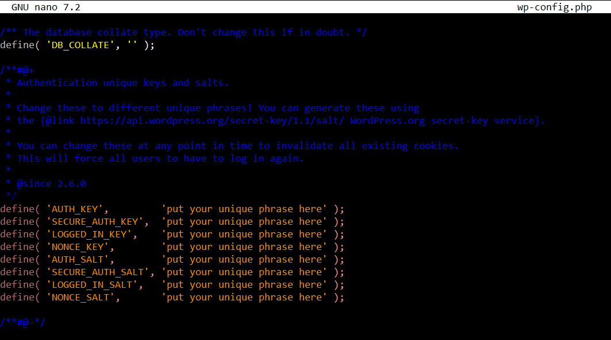

# Advanced WordPress Deployment on AWS

This repository offers a detailed guide for deploying a WordPress server setup on AWS using user data. The deployment utilizes a secure and scalable architecture, following industry best practices for networking, database management, security, and high availability. By implementing this guide, users can ensure a robust and efficient WordPress environment tailored for optimal performance and reliability.

## Table of Contents

- [Advanced WordPress Deployment on AWS](#advanced-wordpress-deployment-on-aws)
  - [Table of Contents](#table-of-contents)
  - [Architecture Overview](#architecture-overview)
  - [Prerequisites](#prerequisites)
  - [Infrastructure Components](#infrastructure-components)
    - [1. Virtual Private Cloud (VPC) \& Subnets](#1-virtual-private-cloud-vpc--subnets)
    - [2. MySQL RDS Database](#2-mysql-rds-database)
    - [3. EC2 Instance for WordPress](#3-ec2-instance-for-wordpress)
    - [4. Application Load Balancer (ALB)](#4-application-load-balancer-alb)
  - [Security Groups Configuration](#security-groups-configuration)
  - [Deployment Steps](#deployment-steps)
    - [Step 1: Create VPC and Subnets](#step-1-create-vpc-and-subnets)
      - [Create a VPC and Configure Subnets Simultaneously](#create-a-vpc-and-configure-subnets-simultaneously)
    - [Step 2: Set Up MySQL RDS Database](#step-2-set-up-mysql-rds-database)
    - [Step 3: Launch EC2 Instance for WordPress](#step-3-launch-ec2-instance-for-wordpress)
    - [Step 4: Set Up Application Load Balancer](#step-4-set-up-application-load-balancer)
    - [Step 5: Connect WordPress to RDS](#step-5-connect-wordpress-to-rds)
    - [Step 6: Finalize WordPress Setup via Browser](#step-6-finalize-wordpress-setup-via-browser)
  - [Conclusion](#conclusion)
  - [Clean-Up](#clean-up)
    - [1. Terminate EC2 Instances](#1-terminate-ec2-instances)
    - [2. Delete RDS Instances](#2-delete-rds-instances)
    - [3. Delete Load Balancers](#3-delete-load-balancers)
    - [4. Delete VPC and Subnets](#4-delete-vpc-and-subnets)
    - [5. Delete Security Groups](#5-delete-security-groups)
    - [6. Delete Key Pairs (Optional)](#6-delete-key-pairs-optional)
    - [7. Review and Confirm](#7-review-and-confirm)

---

## Architecture Overview

The deployment architecture consists of the following components:

1. **VPC** with **3 Public** and **3 Private Subnets** across multiple Availability Zones (AZs) for high availability.
2. **MySQL RDS Database** located in a **Private Subnet** for secure data storage.
3. **EC2 Instance** hosting **WordPress** in a **Public Subnet**.
4. **Application Load Balancer (ALB)** in the **Public Subnets** to distribute incoming traffic.
5. **Security Groups** to manage and restrict access between components.


*Figure 1: Deployment Architecture Overview*

---

## Prerequisites

Before proceeding, ensure you have the following:

- **AWS Account** with necessary permissions to create VPCs, subnets, EC2 instances, RDS databases, and ALBs.
- **SSH Key Pair** for accessing EC2 instances.
- **IAM Roles and Policies** as required for the services.
- **Domain Name** (optional) for accessing the WordPress site via a custom DNS.

---

## Infrastructure Components

### 1. Virtual Private Cloud (VPC) & Subnets

- **VPC CIDR Block:** `10.0.0.0/16`
- **Subnets:**
  - **Public Subnets:** 3
    - **CIDR Blocks:** `10.0.0.0/20`, `10.0.16.0/20`, `10.0.32.0/20`
    - **Usage:** ALB and WordPress EC2 instance.
  - **Private Subnets:** 3
    - **CIDR Blocks:** `10.0.128.0/20`, `10.0.144.0/20`, `10.0.160.0/20`
    - **Usage:** MySQL RDS Database.
- **Purpose:** Isolate the network environment for WordPress deployment with separation between public-facing and internal resources.

### 2. MySQL RDS Database

- **Engine:** MySQL
- **Placement:** Private Subnet
- **Purpose:** Store WordPress data securely.

### 3. EC2 Instance for WordPress

- **AMI:** Amazon Linux 2 / Ubuntu
- **Placement:** Public Subnet
- **Purpose:** Host the WordPress application.
- **Access:** Direct SSH access from trusted IPs.

### 4. Application Load Balancer (ALB)

- **Placement:** Public Subnets
- **Purpose:** Distribute incoming HTTP/HTTPS traffic to WordPress EC2 instances.

---

## Security Groups Configuration

- **WordPress EC2 Security Group:**
  - **Inbound:**
    - SSH (port 22) from trusted IPs (e.g., your office or home IP).
    - HTTP (port 80) and HTTPS (port 443) from ALB Security Group.
  - **Outbound:**
    - MySQL (port 3306) to RDS Security Group.
    - All other necessary outbound traffic.

- **RDS Security Group:**
  - **Inbound:** MySQL (port 3306) from WordPress EC2 Security Group.
  - **Outbound:** None (default deny).

- **ALB Security Group:**
  - **Inbound:** HTTP (port 80) and HTTPS (port 443) from anywhere.
  - **Outbound:** HTTP/HTTPS to WordPress EC2 Security Group.

---

## Deployment Steps

### Step 1: Create VPC and Subnets

#### Create a VPC and Configure Subnets Simultaneously

1. **Navigate to the VPC Console:**

   

   *Figure 2: Navigating to the VPC Console*

2. **Click on "Create VPC":**

   

   *Figure 3: Creating a New VPC*

3. **Configure VPC Settings:**
   - **Name Tag:** `wordpress-vpc`
   - **IPv4 CIDR Block:** `10.0.0.0/16`
   - **Enable DNS Hostnames:** Yes

4. **Create Public and Private Subnets:**

   - **Public Subnets:**
     - **Navigate to Subnets** in the VPC console.
     - Click **Create Subnet**.
     - **Details:**
       - **Name Tag:** `public-subnet-1`
       - **VPC:** `wordpress-vpc`
       - **Availability Zone:** Select AZ1 (e.g., `us-east-1a`)
       - **IPv4 CIDR Block:** `10.0.0.0/20`
       - **Auto-assign Public IPv4:** Yes
     - Repeat for `public-subnet-2` (`10.0.16.0/20`) and `public-subnet-3` (`10.0.32.0/20`) in different AZs.
     
     

     *Figure 4: Creating and Configuring Public & Private Subnets*

5. **Create the VPC:**
   - Click **Create** to finalize.

   

   *Figure 5: VPC Creation Confirmation*


6. **Configure Route Tables:**

   - **Public Route Table:**
     - A route for public route table is created by default:
       - **Destination:** `0.0.0.0/0`
       - **Target:** Internet Gateway (IGW) attached to your VPC.
     - **Associate Public Subnets:**
       - Go to the **Subnet Associations** tab.
       - Associate all **public subnets** with this route table.
      
     
     
     


     *Figure 6: Configuring Public Route Table*

   - **Private Route Table:**
     - Since we're not attaching a NAT Gateway, **private subnets will not have direct internet access**. Ensure that the private route table does **not** include a route to the Internet Gateway or NAT Gateway.
     - All subnets that have not been explicitly associated with a route table would automatically be associated with the VPC **main** route table.
     - **Note**: The main route table of the VPC has no IGW attached so the private subnets does **not** have a route to the Internet Gateway or NAT Gateway
    
    
    


---

### Step 2: Set Up MySQL RDS Database

1. **Launch RDS Instance:**

   

   *Figure 9: Navigating to the RDS Console*

2. **Click on "Create Database":**

   

   *Figure 10: Creating a New RDS Instance*

3. **Configure Database Settings:**
   - **Engine:** MySQL
   - **Version:** Select the desired MySQL version.
   - **Use Case:** Production or Dev/Test as per your requirements.
   - **DB Instance Identifier:** `wordpress`
   - **Master Username:** `admin`
   - **Master Password:** `yourpassword` *(Replace with a strong password)*
  
    
  
   - **DB Instance Class:** Select a suitable instance class based on your requirements.
    

4. **Configure Networking:**
   - **VPC:** Select `wordpress-vpc`.
   - **Subnet Group:** Choose the private subnets (`10.0.128.0/20`, `10.0.144.0/20`, `10.0.160.0/20`).
   - **Public Access:** **No**
   - **VPC Security Groups:** Create or select the RDS security group configured to allow MySQL access from the WordPress EC2 instance.
   - **Note:** In this project we would select the default vpc security group and modify the inbound rules to allow mySQL traffic on port ***3306*** from our wordpress instance security group
   

5. **Additional Configuration:**
   - **Storage:** Configure as needed.
   - **Availability & Durability:** Enable Multi-AZ for high availability.
   ***Note:*** *For this project we would be selecting the ***free tier*** template for cost effectiveness. This disables the option for multi-AZ deployment.*
   
   - **Connectivity:** Ensure it's set to private subnets.

6. **Launch the RDS Instance:**
   - Review all settings.
   - Click **Create Database**.

   
   

   *Figure 11: Launching RDS Instance*

7. **Note the RDS Endpoint and Port:**
   - After the RDS instance is available, note the **Endpoint** and **Port** for configuring WordPress.

   

   *Figure 12: RDS Endpoint Information*

---

### Step 3: Launch EC2 Instance for WordPress

1. **Launch EC2 Instance:**

   

   *Figure 13: Navigating to the EC2 Console*

2. **Click on "Launch Instance":**

   

   *Figure 14: Launching a New EC2 Instance*

3. **Configure Instance Details:**
   - **Name Tag:** `WordPress-Server`
   - **AMI:** Amazon Linux 2 or Ubuntu
   *We are using `ubuntu` for this project*
   - **Instance Type:** `t3.micro` *(Adjust based on requirements)*
   - **Key Pair:** Select your **SSH key pair** or create a new one.
   *We will use the key pair to SSH into your instance, which will give the ability to run commands on our server.*
   - *Open the **key pair (login)** section and choose **Create new key pair** for your instance.*
   
   - Give your key pair a name. Then choose the **Create key pair** button, which will download the .pem file to your machine.
   
   - **Network:** `wordpress-vpc`
   - **Subnet:** Select one of the **public subnets** (`10.0.0.0/20`, `10.0.16.0/20`, `10.0.32.0/20`).
   - **Auto-assign Public IP:** **Yes**
   - **IAM Role:** Assign if necessary.

4. **Add Storage:** Configure as needed.

5. **Add Tags:** Add tags for identification.

6. **Configure Security Group:**
   - **Create a new security group** or select an existing one.
   - **Inbound Rules:**
     - **SSH:** Port 22 from your trusted IPs (e.g., `203.0.133.0/24`)
     - **HTTP:** Port 80 from ALB Security Group
     - **HTTPS:** Port 443 from ALB Security Group
     - ***Note:*** *We would modify our wordpress server security group rules after we provision the ALB and configure it's security group*
   - **Outbound Rules:**
     - **MySQL:** Port 3306 to RDS Security Group
     - **All traffic** as needed.
      
      
      
      
     - ***Note:*** Modified after instance is launched

7. **Configure User Data:**
   - In **Advanced Details**, add the following user data script to install and configure WordPress on boot. Example for Ubuntu:

     ```bash
      #!/bin/bash

      # Update the package list and upgrade all installed packages to their latest versions
      # This ensures we have the most recent software and security updates
      sudo apt update
      sudo apt upgrade -y

      # Install necessary packages:
      # apache2: Web server to host WordPress
      # php: Server-side scripting language required by WordPress
      # php-mysql: PHP extension for MySQL database connectivity
      # mysql-server: Database server to store WordPress data
      sudo apt install -y apache2 php php-mysql mysql-server

      # Start the Apache web server and enable it to start automatically on system boot
      sudo systemctl start apache2
      sudo systemctl enable apache2

      # Change to the default web root directory where we'll install WordPress
      cd /var/www/html

      # Download the latest version of WordPress
      sudo wget https://wordpress.org/latest.tar.gz

      # Extract the WordPress archive
      sudo tar -xzf latest.tar.gz

      # Move WordPress files to the current directory (web root)
      sudo cp -r wordpress/* .

      # Clean up by removing the original archive and the empty WordPress directory
      sudo rm -rf wordpress latest.tar.gz

      # Create a WordPress configuration file from the sample provided
      sudo cp wp-config-sample.php wp-config.php

      # Set the correct ownership for all WordPress files
      # www-data is the user and group that Apache uses by default on Ubuntu
      sudo chown -R www-data:www-data /var/www/html/*

      # Restart Apache to ensure all changes take effect
      sudo systemctl restart apache2

      # Note: After running this script, you'll need to:
      # 1. Set up a MySQL database for WordPress
      # 2. Edit wp-config.php to include your database details
      # 3. Complete the WordPress installation through the web interface   
     ```

     **Important:**
     - Replace `yourpassword` with the actual RDS password.
     - Replace `your-rds-endpoint` with the actual RDS endpoint (e.g., `wordpress-db.xxxxxxxx.us-east-1.rds.amazonaws.com`).

     

     *Figure 15: Configuring User Data for WordPress Installation*

8. **Review and Launch:**
   - Review all configurations.
   - Click **Launch Instance**.

   
   

   *Figure 16: Launching the EC2 Instance*

9. **Wait for Instance Initialization:**
   - Ensure the instance status is **running** and **passed** all status health checks.

   

   *Figure 17: EC2 Instance Running*

---

### Step 4: Set Up Application Load Balancer

1. **Create Target Group:**

   

   *Figure 18: Navigating to Target Groups*

2. **Click on "Create Target Group":**

   

   *Figure 19: Creating a New Target Group*

3. **Configure Target Group:**
   - **Name:** `wordpress-TG`
   - **Target Type:** Instances
   - **Protocol:** HTTP
   - **Port:** 80
   - **VPC:** `wordpress-vpc`
   - **Health Checks:**
     - **Protocol:** HTTP
     - **Path:** `/`
   Under '*Advanced health check settings*', we would use the default settings

4. **Register Targets:**
   - Select the **WordPress EC2 instance**.
   - Click **Include as pending below**.
   - Click **Create target group**.

   
   
   

   *Figure 20: Registering EC2 Instance to Target Group*

5. **Create Application Load Balancer (ALB):**

   

   *Figure 21: Navigating to Load Balancers*

6. **Click on "Create Load Balancer" and Choose "Application Load Balancer":**

   

   *Figure 22: Creating a New ALB*

7. **Configure ALB Settings:**
   - **Name:** `WordPress-ALB`
   - **Scheme:** Internet-facing
   - **IP Address Type:** IPv4
   - **Listeners:** HTTP (port 80)
   

8. **Select VPC and Availability Zones:**
   - Select two (2) or all **public subnets** (`10.0.0.0/20`, `10.0.16.0/20`, `10.0.32.0/20`).
   

9. **Configure Security Groups:**
   - **Create a new security group** or select an existing one.
    Create a new security group
    
    
   - **Inbound Rules:**
     - **HTTP:** Port 80 from anywhere (`0.0.0.0/0`)
     - **HTTPS:** Port 443 from anywhere (`0.0.0.0/0`)
   Since we have no **custom dns** and **ssl certifcate**, we would only allow **http traffic** into the ALB for this project.
   - **Outbound Rules:**
     - **HTTP/HTTPS:** To WordPress EC2 Security Group.
     
     - **Save the security group** and select it for the ALB.
     
     
10. **Configure Routing:**
    - **Target Group:** Select `ALB-TG`
    
     
11. **Review and Create:**
    - Review all settings.
    - Click **Create Load Balancer**.
     *Review config*
    
    *Provisioning load balancer*
    
    *Figure 23: ALB Creation Confirmation*
12. **Verify Load Balancer:**
    - Provisioning a load balancer takes a few minutes till it becomes **active**.
    -  Once it is in an **active** state, note the **DNS name** of the ALB. This would be used to access the wordpress servers and distribute traffic across different availability zones.
    

    

---

### Step 5: Connect WordPress to RDS

Connecting your WordPress EC2 instance to the MySQL RDS database is essential for WordPress to store and retrieve data. Follow the steps below to securely configure this connection.

1. **Verify RDS Instance Availability**

   Before configuring WordPress, ensure that your RDS instance is up and running.

- **Check RDS Status:**

  Navigate to the [RDS Console](https://console.aws.amazon.com/rds/) and ensure that the `wordpress-db` instance status is **Available**.

  

  *Figure 1: RDS Instance Status*

2. **Ensure Security Group Permissions**

   Confirm that the RDS security group allows inbound traffic from the WordPress EC2 instance.

- **Verify/Edit RDS Security Group:**

  1. Select the security group associated with your RDS instance (`default VPC SG`).
   
  2. Under the **Inbound Rules** tab, ensure there is a rule that allows MySQL/Aurora (port **3306**) from the WordPress EC2 security group.

     
     
     

     *Figure 2: RDS Security Group Inbound Rules*

3. **SSH into the WordPress EC2 Instance**
   Access your WordPress server to update the configuration file.
- **Connect to EC2 Instance:**
  ***i.*** Navigate to the EC2 Console, select the wordpress instance and click **connect**.

     
     
   ***ii.*** We would connect to our wordpress instance using the **SSH client** option. 

   
   ```bash
  ssh -i /path/to/your-key-pair.pem ubuntu@<WordPress_EC2_Public_IP> 
  ```
   **Note:** 
   - Replace `/path/to/your-key-pair.pem` with your SSH key path.
   - Replace `<WordPress_EC2_Public_IP>` with the EC2 instance's public IP.
  
  ***iii.*** Next, open a terminal on your machine, switch to the directory where you have your **ssh keys** stored.
  
  ***iv.*** connect to your wordpress instance using the **ssh command**
  
  **Expected output:**
  

4. **Navigate to WordPress Directory:**
   Once connected, navigate to the directory where WordPress is installed.
   ```bash
    cd /var/www/html
   ```
   

5. **Edit `wp-config.php`:**
   Then, open the wp-config.php file using the nano editor by running the following command.

   ```bash
     sudo nano wp-config.php
   ```
   
   **Note:** Replace `sudo nano` with your preferred text editor (e.g., `sudo vim`)

6. **Update Database Settings:**

   ```php
     define('DB_NAME', 'wordpressdb');
     define('DB_USER', 'admin');
     define('DB_PASSWORD', 'yourpassword');
     define('DB_HOST', 'your-rds-endpoint:3306');
   ```
   **Important:**
   - Replace `yourpassword` with your RDS password.
   - Replace `your-rds-endpoint` with your RDS endpoint (e.g., `wordpress-db.xxxxxxxx.us-east-1.rds.amazonaws.com`).
  
   **Expected Output:**
  

  ***Note:*** You also need to configure the **Authentication Unique Keys and Salts**. 
  * You can generate these using the {@link https://api.wordpress.org/secret-key/1.1/salt/ WordPress.org secret-key service}
 * You can change these at any point in time to invalidate all existing cookies. This will force all users to have to log in again.
It looks as follows in the configuration file:

  **Expected output:**


   - **Save and Exit:**
     - Press `Esc`, type `:wq`, and press `Enter` to save changes.


7. **Restart Apache to Apply Changes:**
After updating the configuration, restart the Apache web server:
   ```bash
   sudo systemctl restart apache2
   ```
   **Verification of Apache:**
   Check the status of Apache to ensure it's running without errors:
   ```bash
   sudo systemctl status apache2
   ```
   **Expected Output:**
   

### Step 6: Finalize WordPress Setup via Browser
1. **Retrieve ALB DNS Name:**

i. Navigate to the EC2 Console.
ii. Select Load Balancers from the left menu.
iii. Click on your created Load balancer for the wordpress eerver "WordPress-ALB".
iv. Copy the DNS Name.


---

2. **Access WordPress Installation Wizard:**
i. Open a web browser.
ii. Navigate to http://<ALB_DNS_Name>.
- ***Note:*** Replace <ALB_DNS_Name> with the copied DNS name (e.g., http://wordpress-alb-1234567890.us-east-1.elb.amazonaws.com).
**Expected output:**


Figure 6: WordPress Installation Wizard

3. **Complete the WordPress Installation**
1. **Set up the following:**
     - **Site Title:** Enter your desired site title.
    - **Username:** Create an admin username.
    - **Password:** Set a strong password.
    - **Your Email:** Provide an admin email address.
    - **Search Engine Visibility:** Choose whether to discourage search engines from indexing the site.
**Expected output:**

- Click Install WordPress.
Figure 7: WordPress Installation Wizard

4. **Log in to WordPress Dashboard**

    Once installed, log in using the admin credentials you created:
    **Expected Output:**
  

    **Access WordPress dashboard:**
    **Expected Output:**
   


   

Figure 8: WordPress Dashboard


## Conclusion

Deploying an advanced WordPress setup on AWS provides a robust, scalable, and secure environment for hosting your website. This architecture leverages key AWS services to ensure high availability, efficient traffic management, and enhanced security:

- **VPC**: Provides network isolation
- **EC2**: Hosts WordPress application servers
- **RDS**: Manages the WordPress database
- **ALB**: Distributes incoming traffic

The separation of public and private subnets enhances security by isolating critical components like the database. Implementing security groups further fortifies the infrastructure against unauthorized access.

This deployment strategy not only meets current requirements but also offers flexibility for future expansions and integrations.

## Clean-Up

To avoid unnecessary charges, it's crucial to clean up all AWS resources created during this deployment when they're no longer needed. Follow these steps to terminate and delete the resources:

### 1. Terminate EC2 Instances

1. Navigate to the EC2 Console
2. Select the instances associated with the WordPress deployment
3. Click `Actions` > `Instance State` > `Terminate Instance`

### 2. Delete RDS Instances

1. Navigate to the RDS Console
2. Select the `wordpress` RDS instance
3. Click `Actions` > `Delete`
4. Follow the prompts to confirm deletion

### 3. Delete Load Balancers

1. Navigate to the EC2 Load Balancers Console
2. Select the `WordPress-ALB`
3. Click `Actions` > `Delete Load Balancer`

### 4. Delete VPC and Subnets

1. Navigate to the VPC Console
2. Select the `wordpress-vpc`
3. Ensure all dependencies (subnets, route tables, gateways) are detached or deleted
4. Click `Actions` > `Delete VPC`

### 5. Delete Security Groups

1. Ensure no other resources are using the security groups
2. Navigate to the Security Groups section in the VPC or EC2 console
3. Select the security groups created for WordPress, ALB, and RDS
4. Click `Actions` > `Delete Security Group`

### 6. Delete Key Pairs (Optional)

1. If the SSH key pair is no longer needed, navigate to the EC2 Key Pairs Console
2. Select the key pair and click `Actions` > `Delete`

### 7. Review and Confirm

- Double-check all services to ensure all resources have been successfully terminated and deleted
- Verify that there are no lingering resources that might incur costs

> **Note**: Always ensure you have backups or snapshots of any critical data before terminating resources to prevent data loss.
